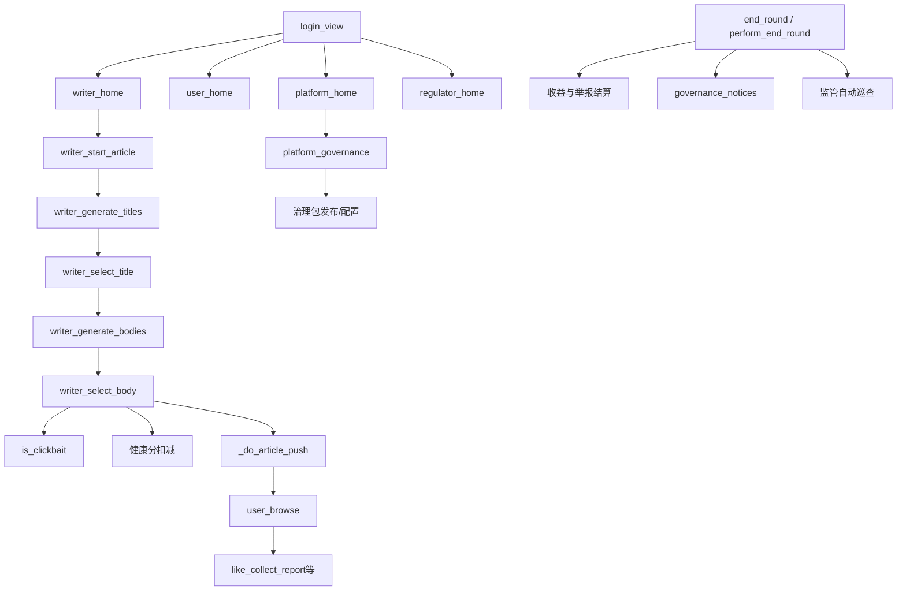

# 项目架构地图

> 新对话处理**业务/路由/模型**前必读。URL 速查见 [ROUTES.md](ROUTES.md)；单功能规则见 [features/](features/)。历史变更见根目录 [WORK_LOG.md](../WORK_LOG.md)。

**最后更新：** 2026-05-21

---

## 1. 项目概述

| 项 | 说明 |
|----|------|
| 名称 | 标题党 / 平台治理沙盘（clickbait-shapan） |
| 用途 | 教学/实验用多角色模拟：写手发文 → 推送 → 用户互动 → 平台治理 → 轮次结算 → 监管行动 |
| 技术栈 | Django 6、单应用 `accounts`、`templates/accounts/*` |
| 项目配置 | `sandbox_site/settings.py`、`sandbox_site/urls.py` |
| 管理入口 | Django Admin `/admin/`；运营台 `/admin/sandbox-ops/`；模拟看板 `/admin/sandbox-monitor/` |

---

## 2. 目录与关键模块

```
clickbait-shapan/
├── sandbox_site/       # settings, urls, callLLM, manage.py
├── accounts/           # models, views, urls, 业务辅助模块
├── templates/accounts/ # 各角色 HTML
├── test/               # pytest + mega_sim
├── docs/               # 本文档体系
├── CLAUDE.md           # AI 协作规范与读档顺序
└── WORK_LOG.md         # 按日期的变更/部署记录
```

| 文件 | 职责 |
|------|------|
| `accounts/views.py` | 几乎全部 HTTP、推送、治理、结算、监管逻辑（大文件，用函数名 grep） |
| `accounts/models.py` | 全部 ORM 模型（中文表名/字段名） |
| `accounts/urls.py` | 业务路由（`app_name = 'accounts'`） |
| `accounts/round_ops.py` | `perform_end_round()`，与 HTTP `end_round`、管理命令共用 |
| `accounts/platform_scope.py` | 平台 ID 校验、`SANDBOX_PLATFORMS`、监管辖区 |
| `accounts/writing_cost.py` | 内容相关度 → 写作成本映射（结算用） |
| `accounts/governance_notices.py` | 轮次切换后账号健康分措施 → 写手收件箱 |
| `accounts/approval_actions.py` | Admin 运营台审批动作 |
| `accounts/admin_operations.py` | 沙盘运营台页面 |
| `accounts/action_logger.py` | 写入 `logs/simulation_actions.log` |
| `accounts/clickbait_judge.py` | 标题党审计口径（巡查/举报，与治理包发布解耦） |
| `accounts/db_retry.py` | SQLite 锁重试装饰器 |
| `sandbox_site/callLLM.py` | DeepSeek API，仅写手生成标题/正文 |

**管理命令：** `end_round`、`load_accounts`、`sync_fans_count`（用法见 [README.md](../README.md)；**服务器部署**见 [DEPLOYMENT.md](DEPLOYMENT.md)）

---

## 3. 角色与 Session

登录：`login_view`（`accounts/views.py`），按表顺序匹配账号，写入 session：

| `session['role']` | 模型 | 首页 `name` |
|-------------------|------|-------------|
| `writer` | `WriterAccount` | `writer_home` |
| `user` | `UserAccount` | `user_home` |
| `platform` | `PlatformAccount` | `platform_home` |
| `regulator` | `RegulatorAccount` | `regulator_home` |

- 认证为**明文密码比对**（沙盘实验特性，非生产安全模型）。
- 用户切换平台后有 `禁止登录截止时间` 冷却（见 `user_switch_platform`）。

---

## 4. 横切：平台

**配置源（唯一真相）：** `settings.SANDBOX_PLATFORMS`，当前为 4 个平台 `(0..3)`。代码通过 `accounts/platform_scope.py` 访问，**勿硬编码「仅 2 平台」**。

| 概念 | 位置 |
|------|------|
| 合法平台 ID | `valid_platform_ids()` |
| 显示名 | `platform_name(platform_id)` |
| 写手/用户所属 | `WriterAccount.所属平台`、`UserAccount.所属平台` |
| 平台账号所属 | `PlatformAccount.所属平台` |
| 监管辖区 | `RegulatorAccount.负责平台编号列表` → `jurisdiction_for_regulator_account()` |
| 推送/记录平台 | `ArticlePush.平台`、`ArticlePushDetail.平台` |
| 治理/配置 | 各 `*Config.platform_id` 或 `平台` 字段 |

**改「随平台」逻辑时的检查清单：**

1. `grep`：`所属平台`、`platform_id`、`writer_platform`、`SANDBOX_PLATFORMS`
2. 是否遍历 `valid_platform_ids()`（结算、结束本轮等）
3. 推送/浏览是否限制同平台用户
4. 监管 UI 是否过滤辖区外平台
5. Admin/运营台审批是否带 `platform_id`

---

## 5. 横切：模拟轮次

| 概念 | 说明 |
|------|------|
| 存储 | `SimulationRound` 单行 `pk=1`，字段 `当前轮次` |
| 读取 | `_get_current_round()` |
| 发文 | `writer_select_body` 写入 `Article.轮次` |
| 用户列表 | `user_browse` 只查 `文章__轮次=current_round` 的推送 |
| 结束本轮 | `POST /end-round/` → `perform_end_round()`：按平台结算 → 轮次 +1 → 治理通知 → 监管自动巡查 |

结束本轮**不删库**；用户端等效于「列表清空进入下一轮」。

---

## 6. 功能树



| 功能域 | 关键符号 | 深页文档 |
|--------|----------|----------|
| 写手发文 + 推送 | `writer_*`, `_do_article_push`, `is_clickbait` | [features/writer-publish.md](features/writer-publish.md) |
| 用户浏览互动 | `user_*`, `ArticlePush` | [features/user-browse.md](features/user-browse.md) |
| 平台治理包 | `platform_governance*`, `PlatformGovernanceMeasure` | [features/platform-governance.md](features/platform-governance.md) |
| 轮次结算 | `end_round`, `perform_end_round`, `_settle_*` | [features/end-round-settlement.md](features/end-round-settlement.md) |
| 监管 | `regulator_*`, `RegulationAction*` | [features/regulator.md](features/regulator.md) |
| Admin 运营 | `sandbox_operations_dashboard` | 本节 §7 |

---

## 7. Admin 沙盘运营台与模拟看板

### 运营台

- **URL：** `/admin/sandbox-ops/`（`accounts/admin_operations.py`）
- **能力：** 待审监管申请、治理措施发布、治理参数、绩效方案等 Tab 审批；可触发结束本轮相关操作
- **与业务关系：** 平台/监管提交的 `pending` 申请在此批准后才 `active` 生效

### 模拟看板

- **URL：** `/admin/sandbox-monitor/`（`accounts/admin_monitor.py`、`accounts/admin_monitor_data.py`）
- **能力：** 用户平台分布（首屏静态）；写手本轮完稿散点（标题+正文非空，刷新/改轮次拉 `api/writers`）；治理包与本轮巡查（改轮次拉 `api/governance`）；监管待审摘要
- **用途：** 管理员观察写手是否全员完稿后再放用户进场

---

## 8. 数据模型索引

### 账号

| 模型 | db_table | 说明 |
|------|----------|------|
| `WriterAccount` | 写手 | 所属平台、健康分、推流系数、粉丝数 |
| `UserAccount` | 用户 | 所属平台、关注数、切换平台冷却 |
| `PlatformAccount` | 平台账号 | 平台负责人登录 |
| `RegulatorAccount` | 监管机构账号 | 负责平台编号列表 |

### 内容与推送

| 模型 | db_table | 说明 |
|------|----------|------|
| `SimulationRound` | 模拟轮次 | 当前轮次（单行） |
| `RoundSnapshotBatch` / `RoundSnapshotPlatform` / `RoundSnapshotWriter` / `RoundSnapshotWriterFan` | 轮次快照 | 结束本轮时写入，见 [end-round-settlement.md](features/end-round-settlement.md) §4.5 |
| `Article` | 文章 | 标题/正文、统计；`is_clickbait`、`clickbait_source`（检测来源，仅 auto/user_report） |
| `Comment` | 评论 | 文章评论 |
| `ArticlePush` | 文章推送记录 | 平台、用户、列表类型 0/1 |
| `ArticlePushDetail` | 文章推送明细 | 是否粉丝 |
| `ArticleTraffic` | （流量记录） | 推送时基础/最终流量与惩罚系数 |

### 用户互动

| 模型 | 说明 |
|------|------|
| `UserFollowWriter` | 关注写手 |
| `UserArticleLike` / `Collect` / `ReadComplete` | 点赞、收藏、读毕 |
| `ArticleReport` | 用户举报 |
| `PlatformSwitchSurvey` / `UnfollowSurvey` | 问卷 |

### 平台治理（配置 + 措施）

| 模型 | 说明 |
|------|------|
| `PlatformGovernanceMeasure` | 措施发布记录（类型、生效轮次、status） |
| `ClickbaitDetectionConfig` / `ClickbaitDetectionResult` | 阈值配置；判定事件（`判定来源` auto/user_report/patrol） |
| `TrafficPenaltyConfig` / `ArticleTraffic` | 流量惩罚 α |
| `UserReportConfig` / `ReportAnomalyRecord` | 用户举报阈值 |
| `RevenuePenaltyConfig` | 收益惩罚 β |
| `AccountHealthConfig` / `AccountHealthLevelConfig` | 健康分规则与档位 |
| `WriterHealthScoreLog` / `WriterGovernanceNotice` | 扣分日志、写手通知 |
| `PlatformPerformanceScheme` | 绩效方案 |

### 监管

| 模型 | 说明 |
|------|------|
| `RegulationActionApplication` / `RegulationAction` | 专项行动申请与正式记录 |
| `PlatformSpotCheckResult` | 抽查结果占位 |
| `PlatformPatrolApplication` / `PlatformPatrolResult` | 监管平台巡查 |
| `PlatformSelfPatrolApplication` / `PlatformSelfPatrolResult` | 平台自查 |
| `RegulatorFineApplication` / `RegulatorFineRecord` | 罚款 |

### 结算

| 模型 | 说明 |
|------|------|
| `ProfitWeightConfig` | 绩效权重 w1～w3、利润窗口 |
| `ArticleRevenueSettlement` | 单篇收益结算 |
| `PlatformCycleProfitRecord` | 平台周期利润 |
| `AdminBaseConfig` | 全局：写作成本映射、自动巡查比例等 |

---

## 9. Feature 文档索引

| 功能 | 文档 | 最后更新 |
|------|------|----------|
| 标题党字段与审计 | [features/clickbait-fields.md](features/clickbait-fields.md) | 2026-05-21 |
| 写手发文与推送 | [features/writer-publish.md](features/writer-publish.md) | 2026-05-21 |
| 用户浏览互动 | [features/user-browse.md](features/user-browse.md) | 2026-05-21 |
| 平台治理包 | [features/platform-governance.md](features/platform-governance.md) | 2026-05-21 |
| 结束本轮结算 | [features/end-round-settlement.md](features/end-round-settlement.md) | 2026-05-21 |
| 监管端 | [features/regulator.md](features/regulator.md) | 2026-05-21 |

---

## 10. 测试

- 目录：`test/`，入口 `uv run python test/run.py`
- 风格样例：`test/tests/test_clickbait_detection.py`、`test_user_report_detection.py`
- 大规模模拟：`test/mega_sim/`
